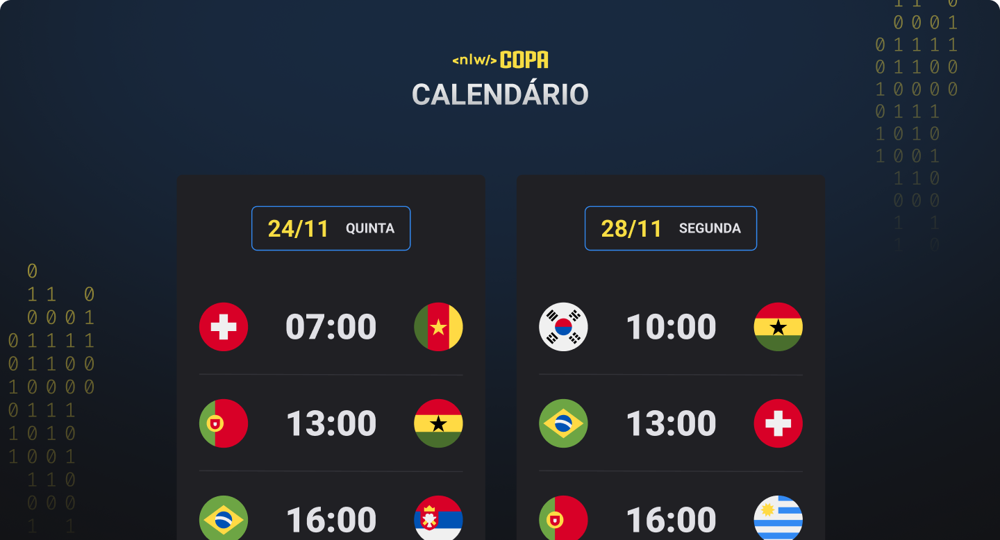

<h1 align="center"> NLW Copa Explorer </h1>

Projeto vindo do evento exclusivo e gratuito, promovido pela Rocketseat para ensino de tecnologias WEB.

  

  

 

  

## 🚀 Tecnologias

Esse projeto foi desenvolvido com as seguintes tecnologias:

- HTML e CSS
- JavaScript

## 💻 Projeto

O NLW Copa é um pequeno calendário de jogos inicias da copa do mundo 2022.

